# MoneyLog

🔗 **[https://moneylog.store](https://moneylog.store)**

1인용 가계부 서비스. 수입/지출 거래 기록, 카테고리별 예산 관리, 목표자산 진행률 추적, 월별 통계 대시보드를 제공합니다. 이메일 회원가입과 구글 소셜로그인(OAuth2)을 지원하며, React(JS) SPA + Spring Boot(Java) REST API + MySQL/Redis로 설계부터 배포까지 직접 구현한 개인 프로젝트입니다.

## 목차

- [개발 동기](#개발-동기)
- [기술 스택](#기술-스택)
- [주요 기능](#주요-기능)
- [아키텍처](#아키텍처)
- [ERD](#erd)
- [폴더 구조](#폴더-구조)
- [API 개요](#api-개요)
- [기술적 의사결정 / 트러블슈팅](#기술적-의사결정--트러블슈팅)
- [실행 방법](#실행-방법)
- [배포 범위](#배포-범위)
- [개선사항](#개선사항)

## 개발 동기

지출을 기록하는 것뿐만 아니라 예산과 목표자산까지 한 곳에서 관리할 수 있는 가계부를 만들어보고 싶어 개인 프로젝트를 시작했습니다.

TypeScript 없이 React(JavaScript)로 구현하면서 React의 기본 구조와 동작을 익히고, JWT 기반 인증을 구현한 뒤 구글 소셜로그인과 Redis까지 적용해 인증 기능을 확장했습니다.

개발은 AI와 협업하되 제안받은 코드를 그대로 사용하지 않고 직접 검증한 뒤 반영했습니다. 작업을 작은 단위로 나누어 진행하고, 주요 설계 결정과 트러블슈팅 과정은 문서로 정리했습니다.

## 기술 스택

<div align="center">

<b>Backend</b><br/>


<br/><br/>

<b>Frontend</b><br/>


<br/><br/>

<b>DevOps</b><br/>


<br/><br/>

<b>Cloud</b><br/>


</div>

## 주요 기능

### 인증
이메일 회원가입/로그인, 구글 소셜로그인(OAuth2). 로그인 여부는 httpOnly 쿠키 기반으로 서버에 매번 확인합니다.

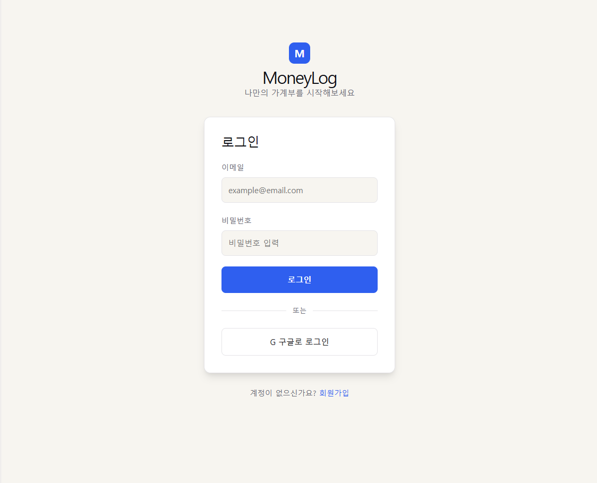

### 홈
인사말, 진행 중인 목표 위젯(진행률), 이번 달 수입/지출/순액 요약, 최근 거래 5건, 바로가기 카드.

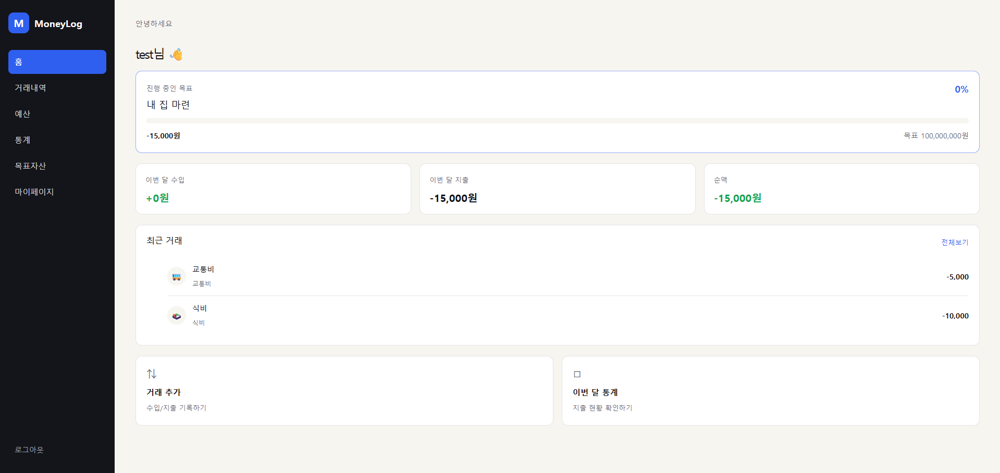

### 거래내역
월 단위 수입/지출 조회, 카테고리별 아이콘 표시, 등록/수정/삭제.

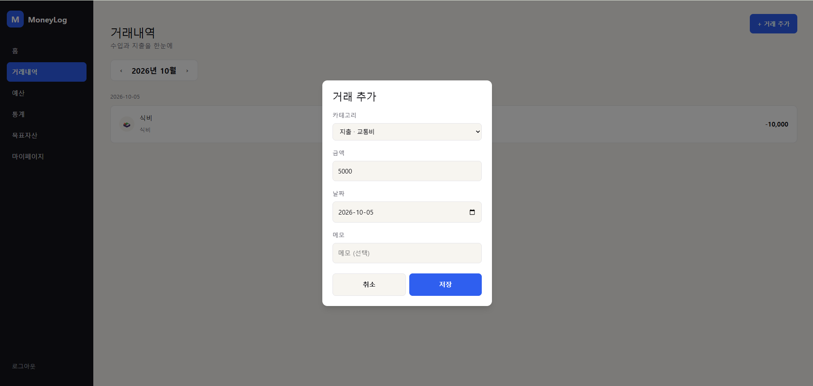

### 예산
카테고리별 월 예산 설정, 지출 대비 진행률 표시, 초과 시 별도 색상 안내.

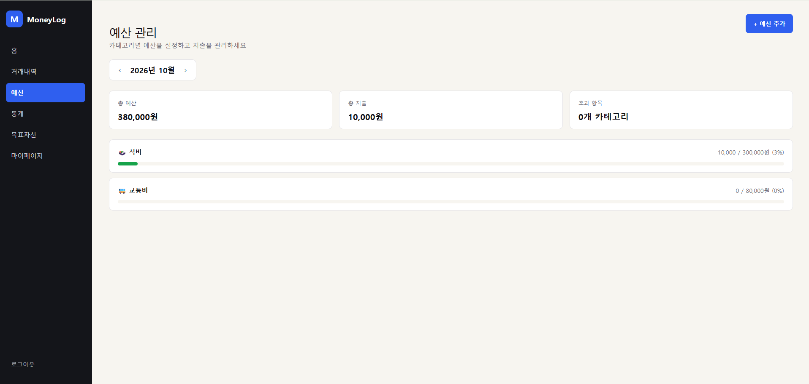

### 목표자산
여러 목표를 등록하고 하나씩 활성화, 활성 목표의 진행률을 조회 시마다 실시간 재계산.

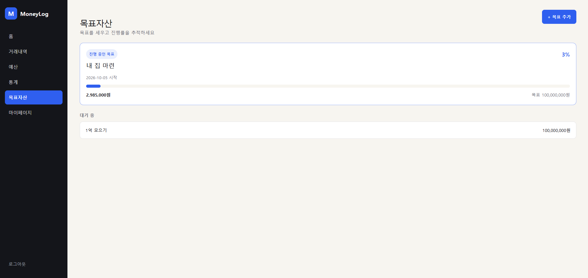

### 통계
이번 달 수입/지출/순액/저축률, 카테고리별 지출 비중(도넛 차트), 최근 N개월 수입/지출 추이(막대 차트).

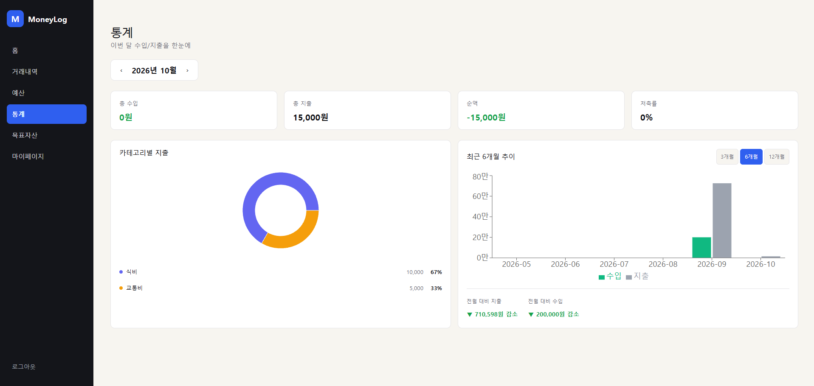

### 마이페이지
닉네임/비밀번호 변경, 회원탈퇴(소프트 삭제 후 30일 유예).

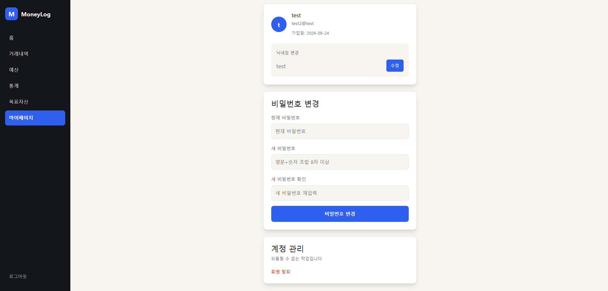

### 반응형

700px 이하에서는 사이드바가 햄버거 메뉴로 전환되고, 카드형 레이아웃은 1열로 쌓입니다.

| 홈 | 거래내역 | 예산 |
|---|---|---|
| 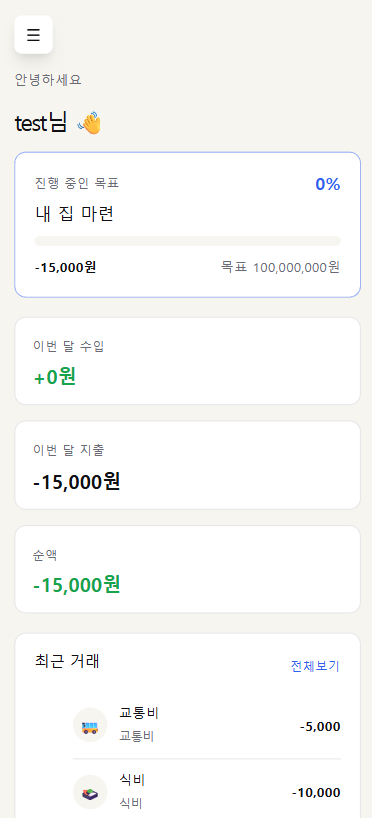 | 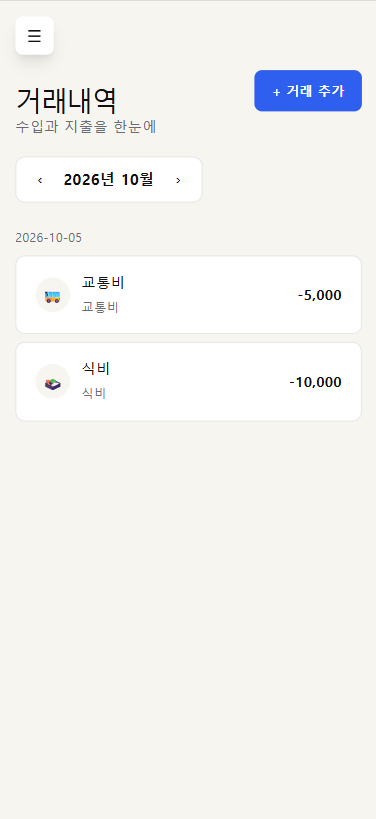 | 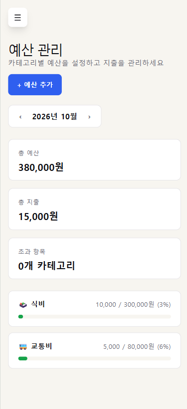 |

| 목표자산 | 통계 | 마이페이지 |
|---|---|---|
| 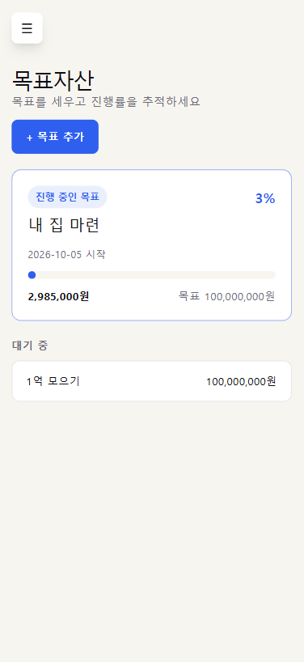 | 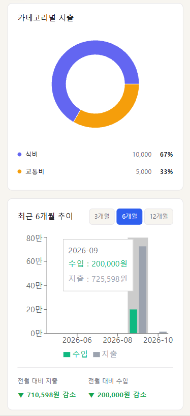 | 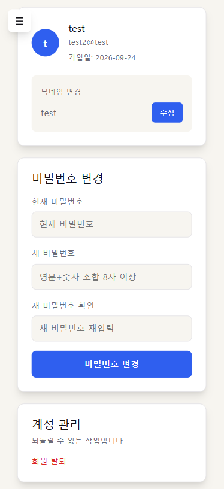 |

## 아키텍처

브라우저는 Nginx 한 곳으로만 접속합니다. Nginx가 정적 React 빌드 결과물을 직접 서빙하고, `/api`·`/oauth2`·`/login/oauth2` 요청만 백엔드로 리버스 프록시합니다 — 브라우저 입장에서 모든 요청이 같은 origin이라 CORS 문제가 생기지 않습니다. `main` 브랜치에 push되면 GitHub Actions가 EC2에 SSH로 접속해 Docker Compose를 재빌드·재기동합니다.

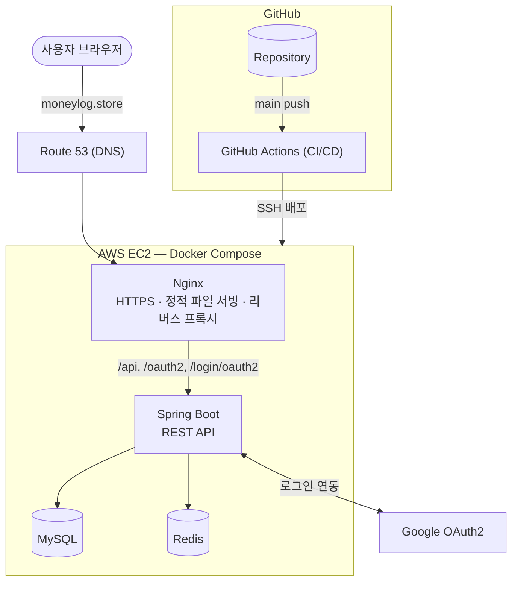

## ERD

`users` 삭제(회원탈퇴 30일 뒤 하드 삭제) 시 `transaction`/`budget`/`goal`/`refresh_token`은 `ON DELETE CASCADE`로 함께 삭제됩니다. 반면 `category`는 고정 시드 데이터라 `ON DELETE RESTRICT`로 삭제 자체를 막습니다 — FK 정책 판단 근거는 [`docs/decisions.md`의 "DB 설계 판단"](docs/decisions.md#db-설계-판단) 섹션(그 안의 "FK 정책" 소제목) 참고, 실행 가능한 스키마는 [`docs/db-schema.sql`](docs/db-schema.sql)이 정답입니다.

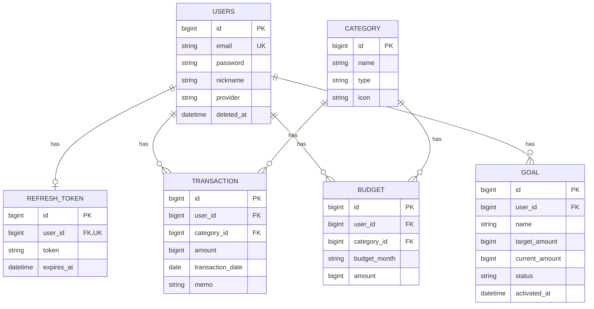

## 폴더 구조

```
moneylog/
├── backend/                         # Spring Boot 백엔드
│   └── src/main/java/com/moneylog/backend/
│       ├── controller/               # REST 컨트롤러
│       ├── service/                  # 비즈니스 로직
│       ├── repository/               # Spring Data JPA 리포지토리
│       ├── entity/                   # JPA 엔티티 (docs/db-schema.sql 매핑)
│       ├── dto/
│       │   ├── request/              # 요청 DTO
│       │   └── response/             # 응답 DTO
│       ├── exception/                # 커스텀 예외 + GlobalExceptionHandler
│       ├── security/                 # 인증/인가 (JWT, OAuth2, Redis 캐시)
│       │   ├── handler/              # 401/403 핸들러
│       │   └── oauth2/               # 구글 소셜로그인
│       ├── scheduler/                # 회원탈퇴 정리 배치
│       └── config/                   # Security, CORS, Redis 등 설정
├── frontend/                         # React(JS) 프론트엔드
│   └── src/
│       ├── pages/                    # 라우트 단위 화면
│       ├── components/               # 재사용 컴포넌트(Sidebar, Modal 등)
│       ├── api/                      # 백엔드 호출 함수(authFetch 포함)
│       └── context/                  # 로그인 상태 등 전역 상태
├── docs/                             # 설계 문서, DB 스키마, 스크린샷
└── docker-compose.yml                # 배포 구성(MySQL/Redis/Backend/Nginx)
```

## API 개요

**인증**
| Method | Endpoint | 설명 |
|---|---|---|
| POST | `/api/auth/register` | 회원가입 |
| POST | `/api/auth/login` | 로그인 |
| GET | `/api/auth/me` | 로그인 상태 확인 |
| POST | `/api/auth/refresh` | AccessToken 재발급 |
| POST | `/api/auth/logout` | 로그아웃 |
| GET | `/oauth2/authorization/google` | 구글 로그인 시작 |

**마이페이지**
| Method | Endpoint | 설명 |
|---|---|---|
| GET | `/api/users/me` | 내 정보 조회 |
| PUT | `/api/users/me` | 닉네임 변경 |
| PUT | `/api/users/me/password` | 비밀번호 변경 |
| DELETE | `/api/users/me` | 회원탈퇴(소프트 삭제) |

**거래 / 카테고리**
| Method | Endpoint | 설명 |
|---|---|---|
| GET | `/api/transactions?month=` | 월별 거래 목록 |
| POST | `/api/transactions` | 거래 등록 |
| PUT | `/api/transactions/{id}` | 거래 수정 |
| DELETE | `/api/transactions/{id}` | 거래 삭제 |
| GET | `/api/categories` | 카테고리 목록 |

**예산**
| Method | Endpoint | 설명 |
|---|---|---|
| GET | `/api/budgets?month=` | 월별 예산 목록 |
| POST | `/api/budgets` | 예산 등록 |
| PUT | `/api/budgets/{id}` | 예산 수정 |
| DELETE | `/api/budgets/{id}` | 예산 삭제 |

**목표자산**
| Method | Endpoint | 설명 |
|---|---|---|
| GET | `/api/goals` | 목표 목록 |
| POST | `/api/goals` | 목표 등록 |
| PUT | `/api/goals/{id}` | 목표 수정 |
| DELETE | `/api/goals/{id}` | 목표 삭제 |

**통계**
| Method | Endpoint | 설명 |
|---|---|---|
| GET | `/api/dashboard/summary?month=` | 월 요약(수입/지출/순액/저축률) |
| GET | `/api/dashboard/category-breakdown?month=` | 카테고리별 지출 비중 |
| GET | `/api/dashboard/monthly-trend?month=&months=` | 최근 N개월 수입/지출 추이 |

## 기술적 의사결정 / 트러블슈팅

개발하면서 실제로 부딪힌 문제와 왜 이렇게 풀었는지를 정리했습니다. 전체 기록은 [`docs/decisions.md`](docs/decisions.md), [`docs/troubleshooting.md`](docs/troubleshooting.md)에 있습니다.

1. httpOnly 전환 중 CSRF 403 에러
2. 마이페이지 수정이 DB에 반영 안 됨 — JPA detached entity
3. 자동 refresh가 무력화됨 — `me()`가 바디 없는 401 응답
4. 탈퇴 계정 로그인 시도가 `permitAll` 경로까지 막음
5. 구글 로그인 콜백 실패 — `SameSite=Strict`가 교차 사이트 리다이렉트를 막음
6. `RedisTemplate` 제네릭 타입 불일치로 빈 주입 자체가 실패
7. `GenericJackson2JsonRedisSerializer`가 Jackson 3를 지원하지 않음
8. authFetch 토큰 재발급이 항상 "실패"로 처리됨 — single-flight 버그
9. AbortController 도입 후 Dashboard가 크래시
10. Spring Boot 4.x 선택 — 3.5 EOL 대응
11. JWT 무상태성 트레이드오프 — 탈퇴 체크를 세 지점에
12. OAuth2 state 쿠키는 Java 직렬화 대신 Jackson JSON
13. Redis 도입 범위 — RefreshToken은 MySQL 유지, fail-open 설계
14. 블랙리스트 Redis 키는 토큰 원문 대신 SHA-256 해시

<details>
<summary><b>펼쳐서 자세히 보기</b></summary>

### 1. httpOnly 전환 중 CSRF 403 에러
localStorage에서 httpOnly 쿠키+CSRF로 전환한 직후, 로그인 요청이 403으로 실패했습니다. `CsrfConfigurer::spa()`는 CSRF 토큰을 실제로 쿠키에 심는 시점을 지연 평가(deferred)하는데, 아무도 그 값을 읽지 않으면 `XSRF-TOKEN` 쿠키 자체가 생성되지 않습니다. 첫 방문이나 쿠키 삭제 직후 첫 `POST` 요청을 보내면 CSRF 토큰 없이 나가 거부당한 것이었습니다. `CsrfFilter` 뒤에 쿠키 생성을 강제로 트리거하는 `CsrfCookieFilter`를 추가해 해결했습니다(Spring 공식 SPA 가이드 패턴).

### 2. 마이페이지 수정이 DB에 반영 안 됨
`PUT /api/users/me`가 200 OK를 응답하는데 DB 값이 그대로였습니다. `@AuthenticationPrincipal`로 받은 `User`는 필터 단계(별도 트랜잭션)에서 조회된 객체라 Service의 `@Transactional` 메서드 시작 시점엔 이미 JPA 영속성 컨텍스트에서 떨어져 나간(detached) 상태 — 필드를 바꿔도 더티 체킹이 추적을 안 해서 UPDATE 자체가 안 나갔습니다. Service 안에서 `userRepository.findById()`로 다시 조회한 managed 엔티티를 쓰도록 수정했습니다.

### 3. 자동 refresh가 무력화됨
AccessToken 쿠키만 지우고 새로고침하면 RefreshToken이 멀쩡히 남아있는데도 로그인이 풀렸습니다. `AuthController.me()`가 인증 실패 시 **바디 없이** 401만 응답하고 있었는데, `authFetch`가 `errorCode`를 확인하려 바디를 파싱하면 실패해서 `TOKEN_INVALID` 판정이 안 되고 refresh를 건너뛴 것이었습니다. 다른 401 응답들과 동일하게 `ErrorResponse` 바디를 포함하도록 통일했습니다.

### 4. 탈퇴 계정 로그인 시도가 `permitAll` 경로까지 막음
탈퇴 계정으로 로그인하면 "탈퇴한 계정입니다"가 아니라 엉뚱한 401이 응답됐습니다. `JWTAuthorizationFilter`는 `permitAll()`인 `/api/auth/login`에도 실행되는데, 남아있던 만료 전 쿠키로 `loadUserByUsername()`을 호출하다 새로 추가한 탈퇴 체크 예외가 try-catch 없이 필터 밖으로 전파돼 `filterChain.doFilter()` 자체가 중단된 것이었습니다. 예외를 캐치해서 인증 등록만 건너뛰고 다음 필터로는 항상 넘어가도록 수정했습니다.

### 5. 구글 로그인 콜백 실패
"구글로 로그인" 클릭 → 구글 인증까지 정상 → 콜백에서 로그인 실패가 반복됐습니다. 디버그 로그로 추적한 결과 `authorization_request_not_found` — state를 저장한 쿠키가 `SameSite=Strict`였는데, 구글에서 돌아오는 콜백은 브라우저 입장에서 교차 사이트 리다이렉트라 `Strict` 쿠키는 이 요청에 실리지 않았습니다. OAuth2 state 쿠키만 `SameSite=Lax`로 바꿔 해결했습니다.

### 6. `RedisTemplate` 제네릭 타입 불일치
Redis 연동 코드를 작성하고 서버를 켜자마자 빈 주입 자체가 실패했습니다. `spring-boot-starter-data-redis`가 자동 설정으로 만들어주는 기본 빈은 `RedisTemplate<Object, Object>` 하나뿐인데, 여러 클래스가 각자 다른 제네릭 타입(`<String, String>`, `<String, UserAuthCache>` 등)을 요구하고 있었습니다. Java 제네릭은 런타임에 타입 정보가 지워져(type erasure) 요구 타입이 안 맞으면 주입 후보에서 제외됩니다. `RedisTemplate<String, Object>` 빈 하나로 통일하고 `instanceof` 체크로 형변환하도록 수정했습니다.

### 7. `GenericJackson2JsonRedisSerializer`가 Jackson 3를 지원하지 않음
Redis 직렬화기를 설정하는데 Jackson 3(Spring Boot 4 기본)으로 만든 `ObjectMapper`를 넘기자 컴파일 자체가 안 됐습니다. `spring-data-redis`엔 이름이 거의 같은 두 클래스가 공존합니다 — `GenericJackson2JsonRedisSerializer`(Jackson 2 전용, deprecated)와 `GenericJacksonJsonRedisSerializer`(Jackson 3 전용). 후자로 교체하니 `PolymorphicTypeValidator` 없이는 다형성 역직렬화도 기본으로 안 열어줘서, 보안 측면에서도 더 안전한 기본값이었습니다.

### 8. authFetch 토큰 재발급이 항상 "실패"로 처리됨
single-flight 패턴으로 리팩터링하다 기존 코드에서 발견했습니다. 진행 중인 refresh 요청을 저장해두는 모듈 변수가 선언조차 안 돼 있었고, `await`한 fetch 결과를 그 변수가 아닌 엉뚱한 변수에 저장하고 있어 함수가 실제 성공 여부와 무관하게 항상 `undefined`(falsy)를 반환했습니다. RefreshToken이 멀쩡해도 매번 재발급 "실패"로 처리된 원인이었습니다.

### 9. AbortController 도입 후 Dashboard가 크래시
월별 조회에 `AbortController`를 붙인 뒤 `Cannot read properties of null (reading 'totalIncome')`로 화면이 깨졌습니다. 요청이 취소(`AbortError`)될 때도 `finally`가 실행돼 `isLoading`이 `false`가 되는데, 성공 데이터는 여전히 `null`인 상태로 렌더링이 그대로 진행된 것이었습니다. `finally`를 없애고 성공/실제 에러 시에만 로딩을 해제하도록 수정했습니다. (`ErrorBoundary`가 실제로 전체 화면 크래시를 막아준 것도 이 과정에서 확인했습니다.)

### 10. Spring Boot 4.x 선택 — 3.5 EOL 대응
백엔드 착수 시점에 Spring Boot 3.5가 이미 OSS 지원 종료(EOL)되어 Spring Initializr에서 선택 자체가 불가능했습니다. EOL 버전은 보안 패치도 안 나와 신규 프로젝트로 부적절하다고 판단해 4.x로 진행 — Spring Security 쪽 DSL이 크게 바뀐 버전(`authorizeRequests()` 완전 제거 등)이라 학습 자료와 실제 문법이 다른 지점을 "개념을 잘못 이해한 것"인지 "버전 문법 차이"인지 구분하는 과정 자체가 학습이었습니다.

### 11. JWT 무상태성 트레이드오프
JWT AccessToken은 서명만 검증하면 되는 게 원래 장점(무상태)인데, 회원탈퇴를 소프트 삭제로 처리하다 보니 "탈퇴했다"는 사실이 토큰 안에는 반영되지 않습니다. 그대로 두면 탈퇴 계정이 AccessToken 만료 전까지(최대 30분) 계속 API를 쓸 수 있는 구멍이 생깁니다. 로그인 시점·매 요청 인가·토큰 재발급(`refresh()`) 세 지점 모두에서 탈퇴 여부를 재확인하도록 해, DB 조회 없이 검증 가능하다는 JWT의 이점을 일부 포기하고 정확성을 택했습니다. 이후 ④단계에서 이 DB 조회를 Redis 캐시로 최적화했습니다.

### 12. OAuth2 state 쿠키는 Java 직렬화 대신 Jackson JSON
`OAuth2AuthorizationRequest`를 Java 표준 직렬화(`ObjectOutputStream`)로 그대로 쿠키에 저장하면, 쿠키는 클라이언트가 조작 가능한 값이라 안전하지 않은 역직렬화로 이어질 수 있습니다(실제 CVE-2023-47174 사례 있음). 필요한 필드만 뽑은 record를 Jackson으로 JSON 직렬화해 타입 주입 여지를 없앴습니다.

### 13. Redis 도입 범위 — RefreshToken은 MySQL 유지
RefreshToken을 Redis로 옮기면 조회는 빨라지지만, Redis는 기본적으로 휘발성이라 재시작 시 전체 로그아웃되는 리스크가 새로 생깁니다. 사용자당 RefreshToken이 1개뿐인 지금 규모엔 이 리스크가 이득보다 커서, "로그아웃해도 AccessToken이 만료 전까지 유효한 문제"와 "탈퇴 여부 매 요청 DB 재조회" 두 가지만 Redis(블랙리스트+캐싱)로 최적화했습니다. Redis 호출이 실패해도 예외를 삼키고 DB로 폴백(fail-open)하게 해, Redis 장애가 로그인 자체를 막지 않도록 설계했습니다.

### 14. 블랙리스트 Redis 키는 토큰 원문 대신 SHA-256 해시
토큰 원문을 Redis 키로 쓰면 만료 전까지 최대 30분간 유효한 토큰이 `KEYS`나 모니터링 도구에 평문으로 노출됩니다. 키의 목적은 "존재 여부 확인"뿐이라 단방향 해시로도 충분해, 원문 노출 없이 동일하게 동작하도록 SHA-256 해시를 키로 사용했습니다.

</details>

## 실행 방법

### 로컬 (Docker Compose)

```bash
cp .env.example .env   # MYSQL_ROOT_PASSWORD/MYSQL_APP_PASSWORD/JWT_SECRET/GOOGLE_CLIENT_ID/GOOGLE_CLIENT_SECRET 채우기
docker compose up --build
```

mysql → redis → backend → nginx 순서로 healthy가 될 때까지 자동으로 기다리고, `http://localhost`로 접속하면 됩니다.

### 로컬 (개별 실행, 기능 단위 개발용)

```bash
# 1. DB 생성 + 스키마 적용
mysql -u root -p -e "CREATE DATABASE moneylog CHARACTER SET utf8mb4 COLLATE utf8mb4_unicode_ci;"
mysql -u root -p --default-character-set=utf8mb4 moneylog < docs/db-schema.sql

# 2. Redis 실행
docker run -d --name moneylog-redis -p 6379:6379 redis:latest

# 3. 환경변수 등록(OS 환경변수로 직접 등록 — .env는 Docker Compose 실행에서만 적용됨)
#    MYSQL_PASSWORD, JWT_SECRET, GOOGLE_CLIENT_ID, GOOGLE_CLIENT_SECRET

# 4. 백엔드
cd backend && ./gradlew test

# 5. 프론트엔드
cd frontend && npm install && npm run dev
```

### 배포 (AWS EC2)

`main` 브랜치에 push되면 GitHub Actions가 EC2에 자동 배포합니다. 상세 구성은 [아키텍처](#아키텍처) 참고, 체크리스트는 [`docs/setup.md`](docs/setup.md) 참고.

## 배포 범위

- 로그인/회원가입(JWT), 구글 소셜로그인(OAuth2), 마이페이지, 회원탈퇴(소프트 삭제)
- 거래 내역, 예산, 카테고리, 통계 대시보드
- 목표자산 관리, 홈 화면
- Redis 기반 AccessToken 블랙리스트·탈퇴 여부 캐싱
- Docker Compose 배포, HTTPS(Let's Encrypt), GitHub Actions CI/CD

## 개선사항

- 환율 API 연동(다중 통화 지원)
- 반복거래
- 사용자 정의 카테고리
